# DeepLearning: Anime Character Detection and Facial Recognition
## Introduction
Japanese animation and manga illustrations has gained popularity in recent times around the globe. There exists many popular shows and within those shows many popular characters emerge. In this project we take a tour into a very unexplored area of face detection of japanese animated characters and classification
 
**Problem Statement:** As anime become more and more popular, the number of fans continue to grow. As a consequence more anime oriented businesses have started to pop up around the globe. With the amount of new anime shows coming out every year, it becomes increasingly difficult for business to keep track of characters in anime shows. Sometimes, customers will find an interesting anime character from an image without any identifying information and would like to see if any products in the store exists. As a business owner, it would be useful to have a detection system to get information from the image to see if they have such any such products. For this project, we train a convolutional neural network (CNN) model to identify anime characters by name. We then combine this model with a pretrained haar cascade face detection model to make a facial recognition model.

**What Data Will We Collect?:** We collect face images of various characters from the following
1. Google Image Scraper
2. DANBOORU2020: Over 2.9 Million Images of anime characters, with about n=300K labeled images.
 
## Work Flow:

## Pretrained Haar Cascade Model
In order to detect faces on images, we use a pre-trained Haar Cascade Model (lbpcascade_animeface) which was obtained from https://github.com/nagadomi/lbpcascade_animeface. The model has an 82% detection rate for animated faces. The model does has some draw back by giving some false positives boundary boxes. But overall does a ok job at detecting faces.
 
## Road Map
We will present a total of four different models. We will
train on four different datasets:
1. Three characters 
2. Ten characters 
3. Twenty characters 
4. 113 characters
We try to see the performance of each model by keeping track validation metrics.
##  Three Character Model
For this first model we trained on three characters from the popular anime show Naruto:
1. Naruto Uzumaki, Sasuke Uchiha, Sakura Haruno.
2. 50-200 data samples for each character was obtained.
Below is the performance of the model

Furthermore we ran examples on a few individual images as seen below:
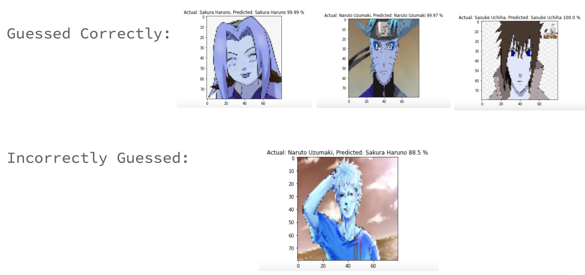
Finally we combined the our trained CNN model with the Haar Cascade model to identify characters in a picture with mutliple characters. 
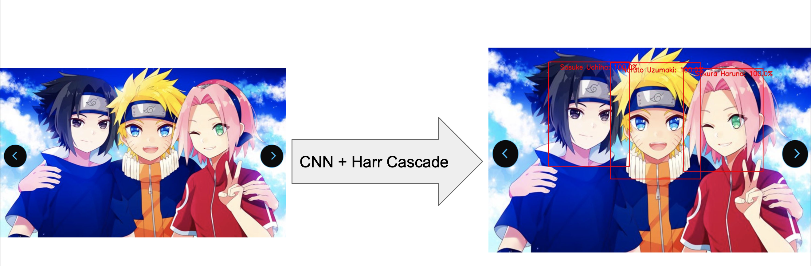
##  Ten Character Model
For this second model we trained on ten characters from the popular anime show Naruto, Yu Yu Hakusho and Kuroko no Basketball. Used Data Augmentation to avoid overfitting.
1. Naruto Uzumaki, Sasuke Uchiha, Sakura Haruno, Yusuke Urameshi, Kazuma Kuwabara, Hiei, Kurama, Keiko Yukimura, Tetsuya Kuroko, Akashi Seijuro.
Below is the performance of the model
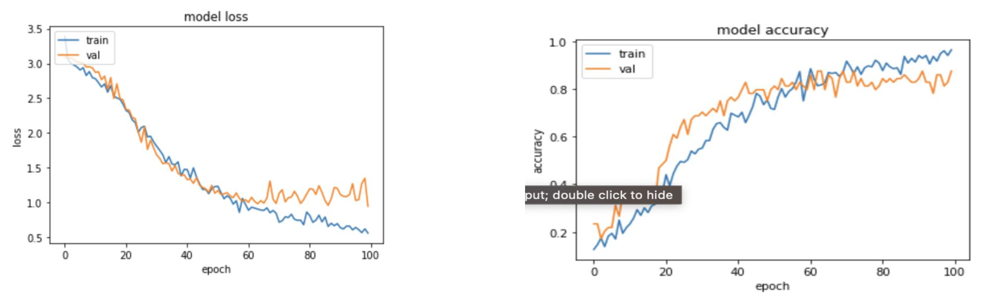
Furthermore we ran examples on a few individual images as seen below:
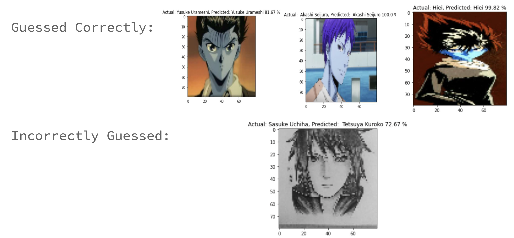
Finally we combined the our trained CNN model with the Haar Cascade model to identify characters in a picture with mutliple characters. 
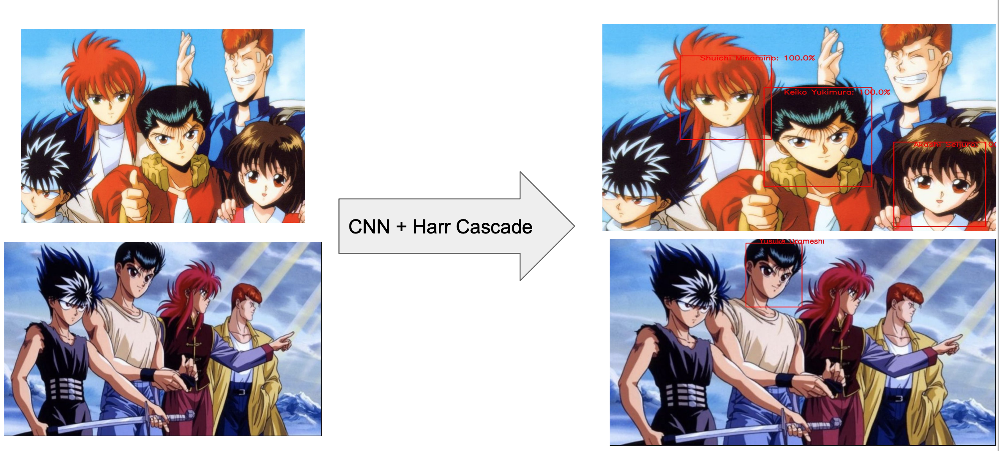
##  Twenty Character Model
For this third model we trained on twenty characters from various shows. Used Data Augmentation to avoid overfitting.
Below is the performance of the model
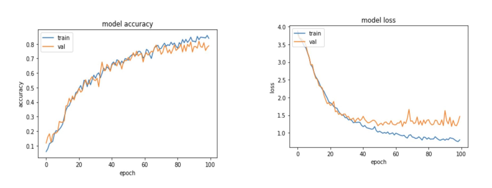
Furthermore we ran examples on a few individual images as seen below:
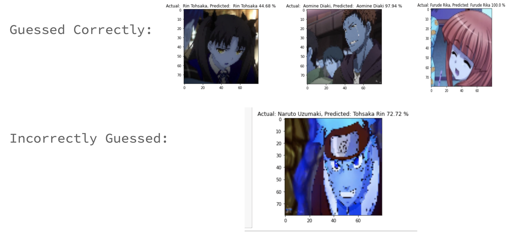
Finally we combined the our trained CNN model with the Haar Cascade model to identify characters in a picture with mutliple characters. 
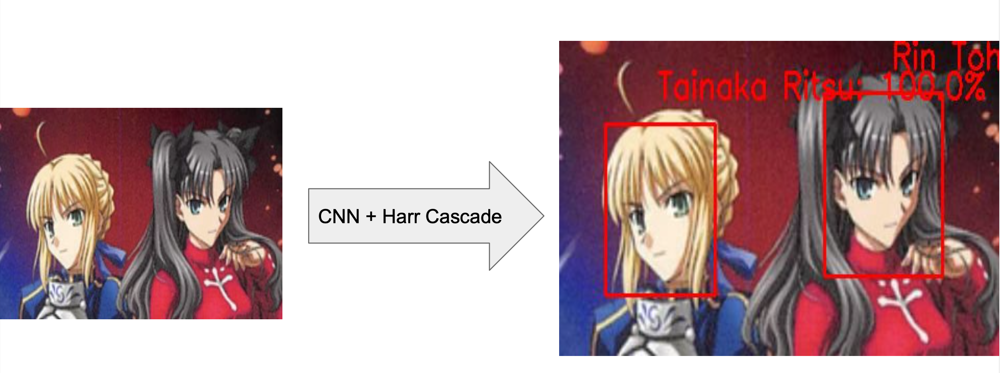
##  113 Character Model
For this third model we trained on 113 characters from various shows. Used Data Augmentation to avoid overfitting.
Below is the performance of the model
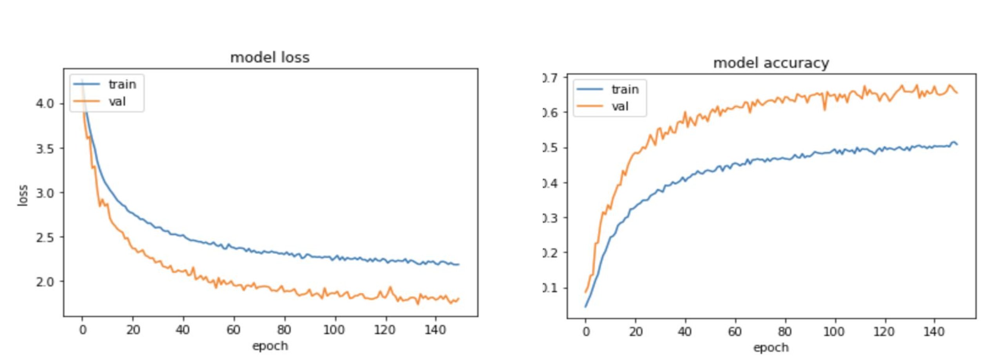
Furthermore we ran examples on a few individual images as seen below:
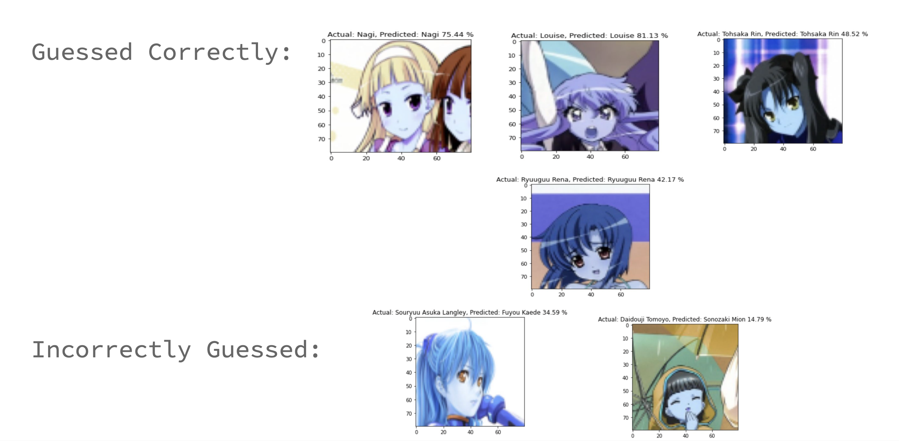
Finally we combined the our trained CNN model with the Haar Cascade model to identify characters in a picture with mutliple characters. 
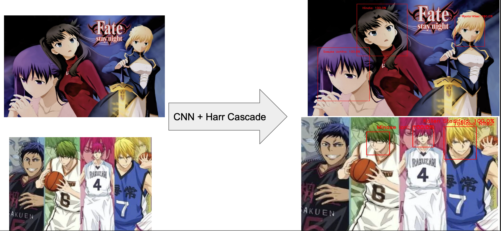
## Video Implementation
I used OpenCV to read in frames from various scenes from different shows and our trained CNN model to identify characters. We see performance on three scenes from three different shows: Yu Yu Hakusho, Kuroko no Basketball and Naruto.

https://user-images.githubusercontent.com/52713751/135700896-e8bdd9ab-0aa5-494d-a519-fe08d534c0ea.mp4

##  Conclusion/Recommendations and Future Improvements
**Problems Needed to Address:**
Facial Recognition of anime characters is a quite challenging problem to solve. Some issues observed is that false positives
could be dues to animation styles.
Character drawing styles may vary from artist. Especially in a seasonal anime show, when artist are on rotations for drawing the
episodes.
**Future Work:**
While the Haar Cascade Model (lbpcascade_animeface) was a good pre-trained model to detect faces in pictures, we could build on
it to increase accuracy by using transfer learning or just making a completely new model. This will significantly increase the
number of detections made on screen.
Improve accuracy on 113 character model using more advanced data augmentation techniques or mine better data by hand. Would like
to focus on improving true positive rate.
**Recommendations:**
Currently the model is not ready to be used for practical use, however one may use various other techniques such as ensemble
modeling.
One suggestion is train models by show and then combine them at the end to get best results.
 
